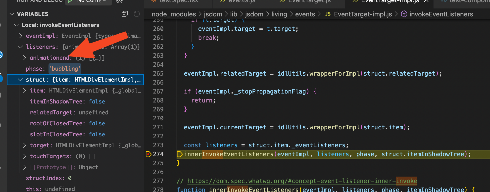

Sample repo that shows a problem where `fireEvent.animationEnd` does not work for a preact component.

To reproduce 

```
yarn install
yarn test
```

Note that all tests are green

now change the version of `@testing-library/preact": "^3.2.2"`

```
yarn install
yarn test
```

Note that the test fails now.

## Details

The following does not work

```typescript
export interface TestComponentProps {
  onNextClick?: () => void;
}

export const TestComponent: FunctionComponent<TestComponentProps> = ({
  onNextClick,
}) => {
  return (
    <div data-countdown onAnimationEnd={onNextClick}>
      FOO
    </div>
  );
};

```

and the corresponding test
```typescript

  it("should call onNextClick on animation end", async () => {
    //given
    const props = {
      onNextClick: jest.fn(),
    };

    //when
    const { container } = render(<TestComponent {...props} />);

    fireEvent.animationEnd(
      container.querySelector("[data-countdown]") as HTMLElement
    );

    //then
    expect(props.onNextClick).toHaveBeenCalledTimes(1);
  });
```

The problem appears that the listeners in jsdom are registered with `AnimationEnd` while the event being fired is `animationend`.

Note that this worked in `@testing-library/preact": "^2.0.1"` but fails with the current version `3.2.2`.

Screenshot of the listeners in jsdoms `EventTarget-impl.js` `invokeEventListeners`

